# 虚拟机安装

在ubantu系统中安装windows虚拟机

### 一、VMware安装

在ubantu系统中安装虚拟机软件非常简单，Ctrl+Alt+T打卡命令控制行，依次输入：

```
sudo apt update #更新软件包列表
```

```
sudo apt install virtualbox #下载安装virtualbox
```

```
sudo virt-manager #打开virtualbox
```

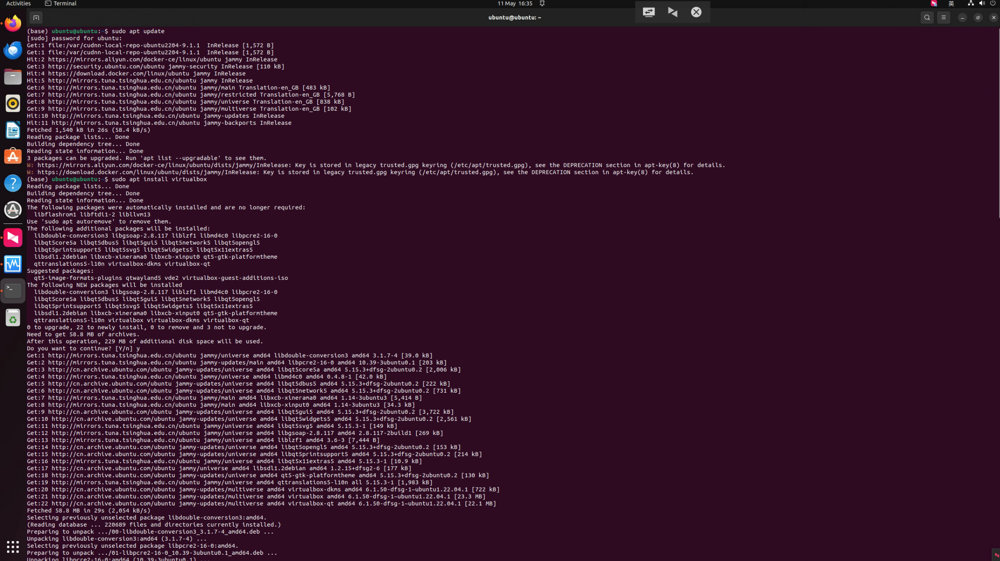

也可以在应用列表中选择virtualbox图标打开。

### 二、创建虚拟机

1.在软件页面点击NEW创建新的虚拟机。

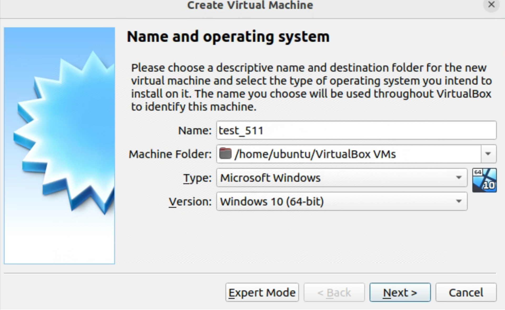

2.输入所要创建的虚拟机的名称和系统类别，在此选择Windows 10系统，并下载相对应的系统镜像文件。


3.根据需要设置虚拟机的内存和硬盘大小、类型。

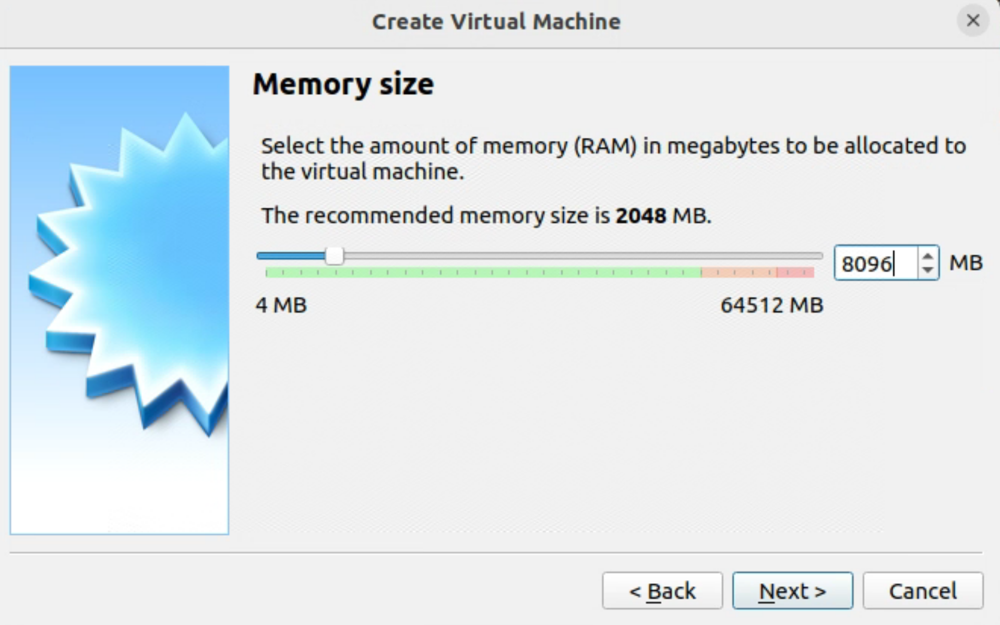

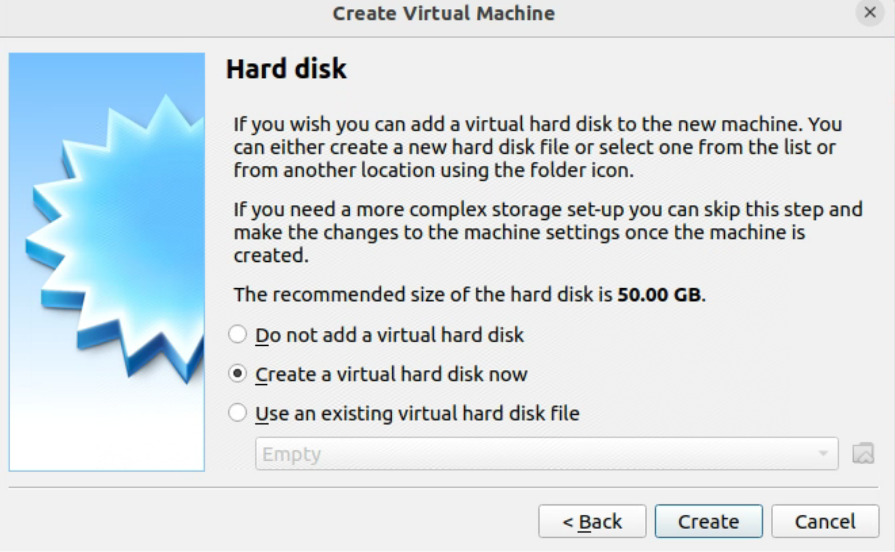

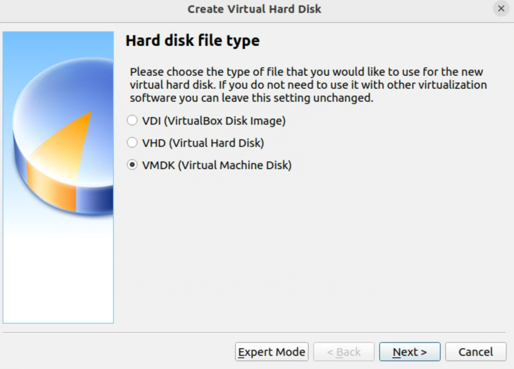

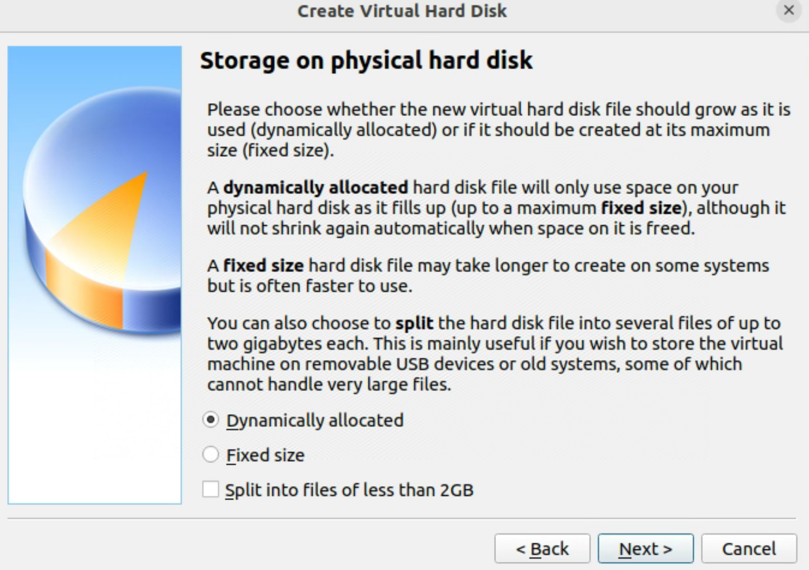

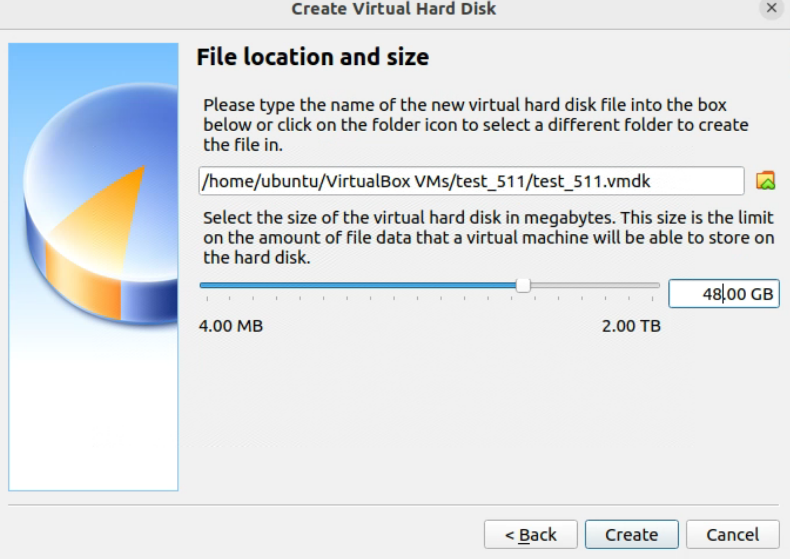

3.创建完成后，点击Start启动虚拟机，并等待创建完成。

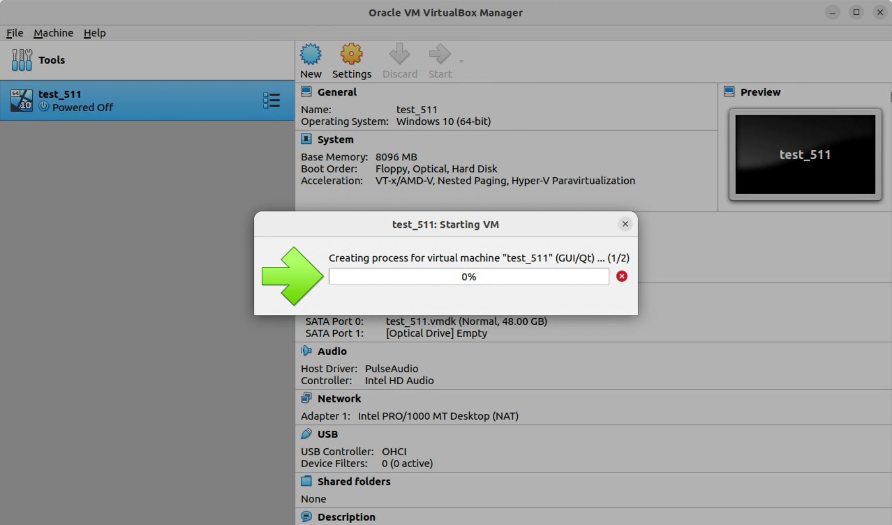

4.新创建的虚拟机没有操作系统，在虚拟机开机页面选择 Devices -> Optical Drives -> Choose a disk file。

选择下载好的系统光盘映像文件。


5.虚拟机进入系统安装界面，按照提示安装系统。

注意：本安装仅为示例，安装的是普通家庭版，且为自定义：仅安装windows（高级）选项，如需安装工作站版或选择升级安装选项，需要获取安装密钥或下载破解版系统。

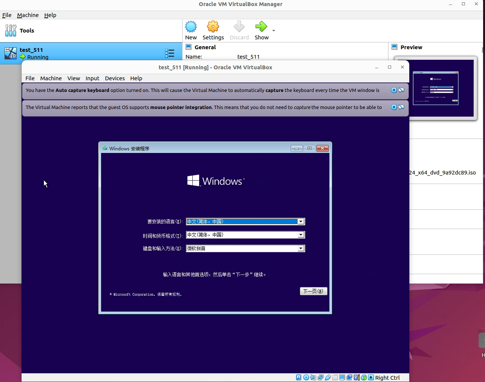

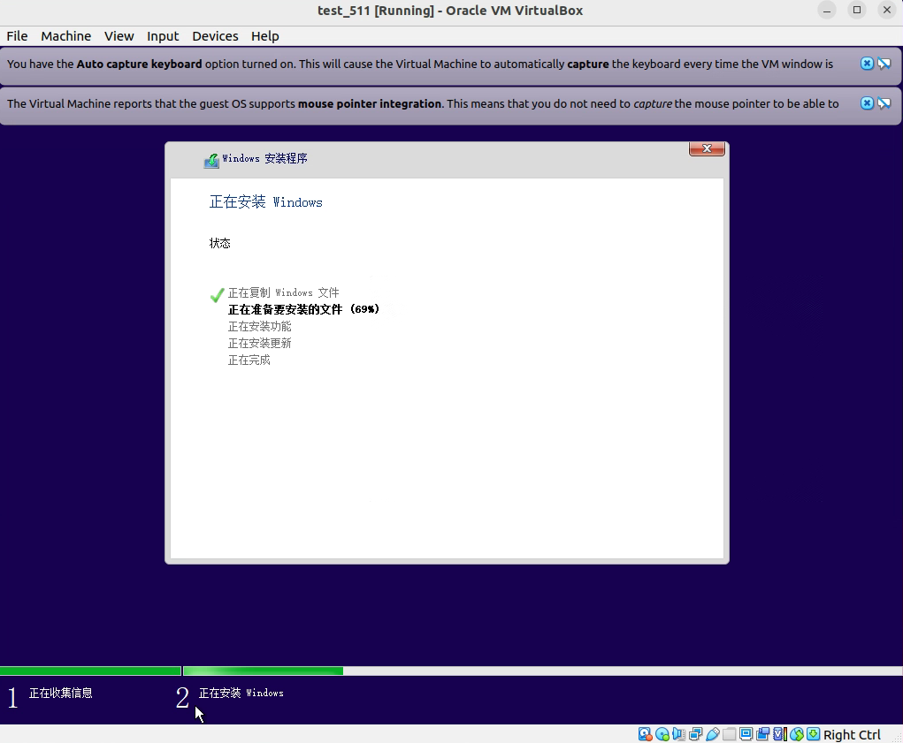

全程点击默认或者跳过，即可快速安装完成。

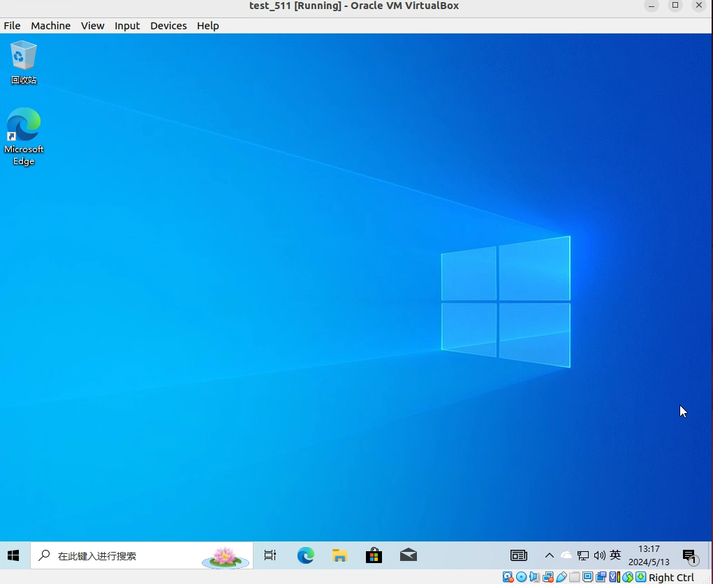


